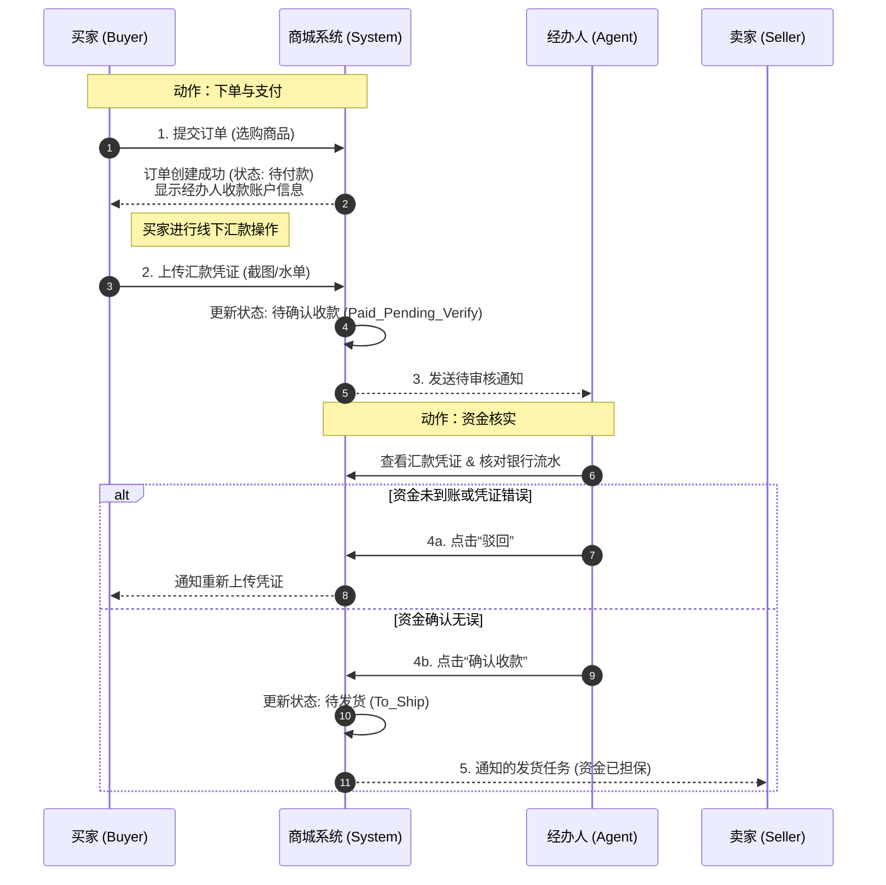
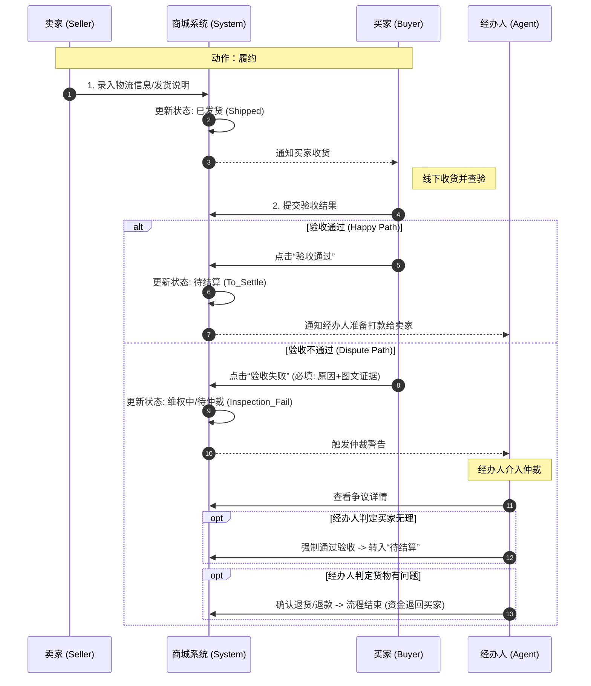
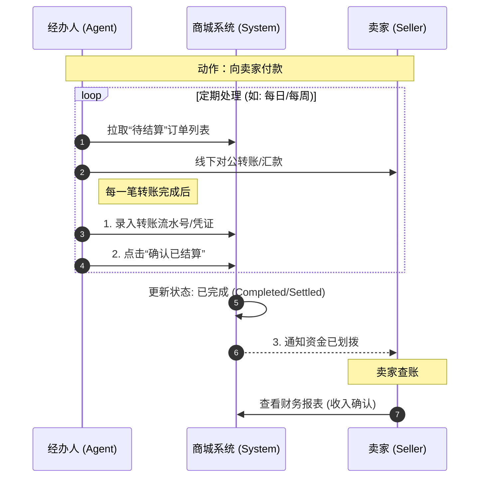

这是一个非常棒的决定。**时序图（Sequence Diagram）** 是开发复杂业务流（尤其是涉及多角色交互和资金流转）时最强有力的工具。

在B2B场景下，你的这个流程设计体现了\*\*“资金担保”**和**“人工强控”\*\*的特点，这确实是系统的核心亮点：**它用系统流程解决了B2B交易中最大的痛点——信任问题。**

我将整个流程拆分为三个核心阶段的时序图，并附带详细的技术与业务描述。你可以直接将这些发给你的开发团队。

-----

### 第一阶段：下单与资金托管 (Order & Escrow)

**核心逻辑：** 这里的亮点在于\*\*“不见兔子不撒鹰”\*\*。卖家在没有收到系统（经办人）确认资金到账的通知前，是看不到发货任务的。这保护了卖家不会发了货收不到钱，也保护了买家汇了款有据可查。

#### 亮点描述：

1.  **凭证数字化**：步骤2中，强制要求上传凭证，将线下行为线上化，留存证据，避免口头扯皮。
2.  **状态防火墙**：注意步骤5，只有Agent确认收款后，System才会通知Seller。这意味着**Seller不需要关心买家是否真的汇款，只要系统通知发货，就代表平台已经为这笔钱背书了。**

-----

### 第二阶段：发货与验收 (Shipping & Inspection)

**核心逻辑：** 这一阶段的亮点是\*\*“验收权前置”\*\*。传统的电商是确认收货后自动打款，而B2B往往涉及货物质量、损耗的争议，因此这里设计了“验收不通过”的强阻断机制。

#### 亮点描述：

1.  **图文证据链**：在“验收不通过”的分支中，系统强制要求图文证据。这对于B2B大宗交易至关重要，因为退货成本极高。
2.  **仲裁机制**：不同于C端通常偏向买家，B2B系统引入Agent作为仲裁者（第2个 `opt` 块），保证了交易的公平性，防止买家恶意拒收压款。

-----

### 第三阶段：最终结算 (Settlement)

**核心逻辑：** 这是闭环的最后一步。亮点在于\*\*“账实分离的二次确认”\*\*。虽然钱是经办人线下转给卖家的，但必须在系统里记一笔账，确保系统内的财务报表是平的。

#### 亮点描述：

1.  **批量处理能力**：时序图展示了`loop`（循环），暗示经办人可以定期批量处理结算，符合财务工作习惯（例如每周五统一结款）。
2.  **财务闭环**：最后一步不仅是改状态，更是生成了“支出记录”。这样未来对账时：**买家汇入总额 = 卖家结算总额 + 经办人佣金（如有） + 在途资金**，账目一目了然。

-----

### 给开发团队的附加建议 (Implementation Tips)

为了确保这个设计落地，请提醒你的开发团队注意以下几点技术细节：

1.  **状态机的原子性**：
      * 订单状态流转必须是**不可逆**的（除非管理员介入）。例如，一旦进入“待结算”，买家就不能再点击“申请退货”。
2.  **超时自动提醒**：
      * 在**阶段一**：如果买家上传凭证后，经办人24小时未确认，系统应发送短信/邮件提醒经办人。
      * 在**阶段二**：如果卖家发货后，买家超过（例如7天）未验收，系统应自动“默认验收通过”，防止资金长期被冻结。
3.  **图片存储**：
      * 鉴于B2B验收可能涉及大量高精度的货物照片，图片存储服务（如OSS/S3）需要预留足够的空间和带宽。

这套设计将你的商城从一个简单的“信息展示工具”升级为“交易信用平台”，非常有商业价值。希望这些图表能帮助你顺利推进开发！
